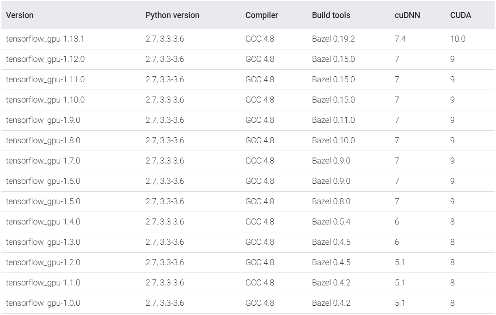

# Tensorflow Test File

This file is intended to test the TensorFlow package installation.
Successfull execution of the file indicates that you have correctly installed TensorFlow and you are able to use your GPU.

# How to use it

- You can run it by `python tensorflow_test.py` 
- Note that the parameter `NUM_ELEMENTS` is used to control the number of loops.
    - You can reduce its value if you have a memory error

- There is also a reuiqrement file that you can directly use to setup the environment
    - You can do the following steps to setup environment:
        1. Setup environment: `conda create -n tf_test python=3.7`
        2. Install packages: `conda install --file requirements.txt`
        3. Run file: `python tensorflow_test.py`

# TensorFlow version compatibility

If you are having trouble install the correct version combinations of Tensorflow, cuda, cudnn, here is a super userful image:

And a super useful link which is where the image came from:
- https://www.tensorflow.org/install/source#tested_build_configurations

# Reference:
- https://www.tensorflow.org/guide/using_gpu
- https://linuxhint.com/gpu-programming-python/